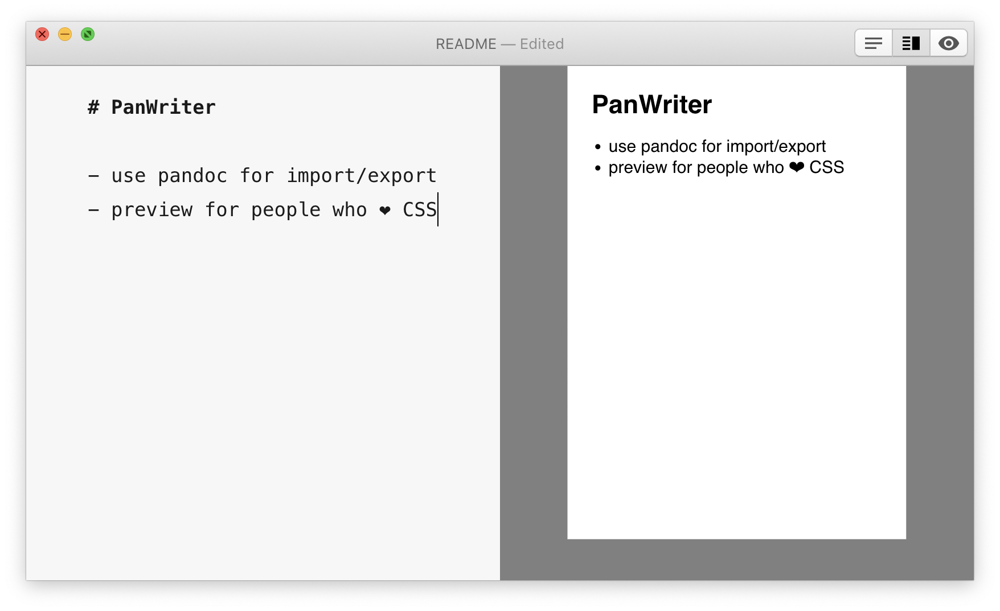

# PanWriter

PanWriter is a distraction-free markdown editor with two unique features:

1. Tight integration with pandoc for import/export to/from plenty of file formats (including HTML, docx, LaTeX and EPUB).
2. Preview pane that can show pages – including page breaks etc. Layout adjustments are immediately reflected in the preview.

Read the [MANUAL](https://www.panwriter.com/MANUAL.html) for more info.

**[Download PanWriter](https://www.panwriter.com)**

You also have to [install pandoc](https://pandoc.org/installing.html) to export to most formats.

Feedback, suggestions and contributions very much welcome! Please open an issue to start a conversation.

## Develop

Install git and [yarn](https://yarnpkg.com/), then:

    git clone git@github.com:mb21/panwriter.git
    cd panwriter
    yarn install

    ## To run the app in development mode:
    yarn run electron:dev

    ## To build distributable app package (goes to ./dist):
    yarn dist

Check out the `package.json` for more scripts to run.

### TODOs

- Preview:
    - respect `css`, `toc` metadata fields
- Editor:
    - expand `Format` menu
    - spell check
    - improve find/replace
- add a Settings/Preferences window (or should this just be a `settings.yaml` file?) where you can:
    - set a CodeMirror editor theme css
    - edit the default CSS and YAML files
    - choose `pandoc` executable (probably with file-open dialog, which we can use for app sandboxing with security-scoped bookmarks)
- Write pandoc lua filter that does some PanWriter-specific transformations:
  - add [page-break syntax](https://github.com/jgm/pandoc/issues/1934#issuecomment-274327751)
  - [Variable substitution in body](https://github.com/jgm/pandoc/issues/1950#issuecomment-427671251)
  - read out `type` metadata and if it references a css file, put the path into the `css` metadata variable
- GUI popup on file import: at least allow to set `-f` (lots of formats use .xml suffix), `-t`, (especially extensions: `--list-extensions` for each format?!), `-t`, `--track-changes` and `--extract-media` pandoc options.
- Unify PanWriter custom document type and pandoc template concepts?
- Rename `type` metadata key to `doctype`?

## Powered by

PanWriter is powered by (amongst other open source libraries):

- [pandoc](http://pandoc.org) (import/export)
- [Electron](https://electronjs.org) (app framework)
- [CodeMirror](https://codemirror.net) (editor)
- For the preview pane:
    - [pagedjs](https://gitlab.pagedmedia.org/tools/pagedjs)
    - [markdown-it](https://github.com/markdown-it/markdown-it#markdown-it)
    - [KaTeX](https://katex.org)
